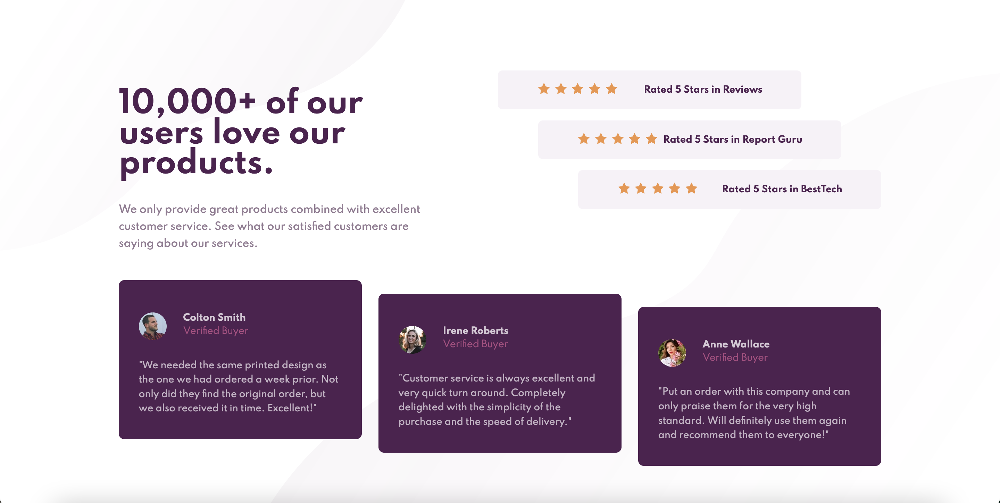

# Frontend Mentor - Easybank landing page solution

This is a solution to the [Social Proof Section challenge on Frontend Mentor](https://www.frontendmentor.io/challenges/social-proof-section-6e0qTv_bA). Frontend Mentor challenges help you improve your coding skills by building realistic projects. 

## Table of contents

- [Overview](#overview)
  - [The challenge](#the-challenge)
  - [Screenshot](#screenshot)
  - [Links](#links)
- [My process](#my-process)
  - [Built with](#built-with)
  - [What I learned](#what-i-learned)
  - [Useful resources](#useful-resources)

## Overview

### The challenge

Users should be able to:

- View the optimal layout for the site depending on their device's screen size

### Screenshot



### Links

- Solution URL: [https://github.com/RickyReyes/social-proof-section](https://github.com/RickyReyes/social-proof-section)
- Live Site URL: [https://social-proof-section-tau-ochre.vercel.app/](https://social-proof-section-tau-ochre.vercel.app/)

## My process

### Built with

- Semantic HTML5 markup
- Sass custom properties
- Flexbox
- Mobile-first workflow

### What I learned

- Getting comfortable using Flexbox.
```html
    <div class="buyer-flex">
        <div class="buyer-flex-left"></div>
        <div class="buyer-flex-right"></div>
    </div>
```

- First time using clamp to set a responsive font size.

```css
.proud-of-this-css {
    font-size: clamp(1.5rem, 3vw, 3rem);
}
```

### Useful resources

- [freeCodeCamp](https://freeCodeCamp.org)
- [Kevin Powell's YouTube Channel](https://www.youtube.com/KevinPowell)